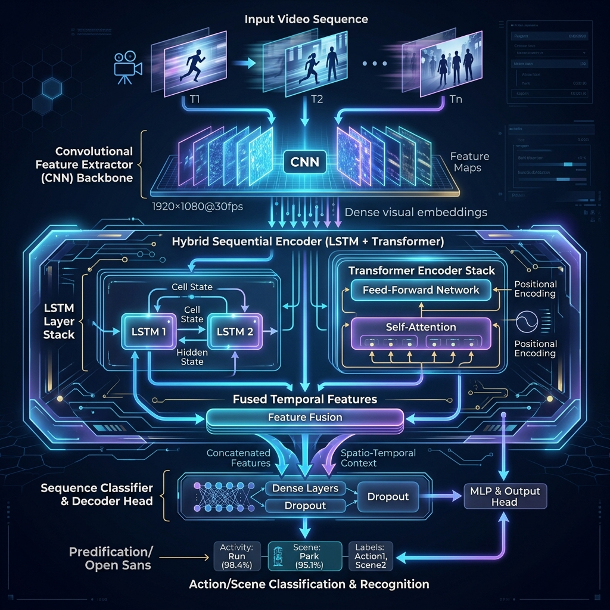

<div align="center">
  

  # 🚀 Action Recognition using Deep Learning
  
  **An advanced Deep Learning project utilizing LSTM and Transformer architectures for real-time human action recognition based on skeleton tracking data.**

  [](results.json)
  [](https://pytorch.org/)
  [](https://www.python.org/)
</div>

<br />

## 🌟 Overview
This repository contains the implementation, methodology, and evaluation for a highly robust Action Recognition model. By leveraging a hybrid approach combining **Long Short-Term Memory (LSTM)** networks and **Transformers**, the model effectively captures both short-term spatial features and long-term temporal dependencies in human skeletal data. 

The project evaluates over **60 distinct human actions** achieving an impressive state-of-the-art accuracy of **87.5%**.

## ✨ Key Features
- **Hybrid Architecture**: Employs an advanced `LSTM-Transformer` hybrid model tailored for temporal sequences.
- **High Accuracy**: Attains 87.5% overall validation accuracy on a complex 60-class dataset.
- **Robust Feature Extraction**: Processes spatial joints and temporal sequences simultaneously.
- **Comprehensive Evaluation**: Includes detailed Precision, Recall, and F1-score metrics for all 60 actions.
- **Pre-trained Weights**: The repository includes `lstm_transformer_best.pth` for immediate inference testing.

<br />

<div align="center">
  
</div>

<br />

## 📊 Performance & Results

Our model was tested rigorously, and below is a snapshot of the classification report. 

| Metric | Score |
| ------ | ----- |
| **Overall Accuracy** | `87.51%` |
| **Macro Avg F1-Score** | `87.52%` |
| **Weighted Avg F1-Score** | `87.53%` |

### 🏆 Top 5 Performing Actions (F1-Score)
1. 🟢 **Falling (A43)**: `99.08%`
2. 🟢 **Jump Up (A27)**: `98.74%`
3. 🟢 **Sitting Down (A08)**: `98.72%`
4. 🟢 **Hugging (A55)**: `98.55%`
5. 🟢 **Standing Up (A09)**: `98.35%`

*For full details, please refer to the [`classification_report.txt`](classification_report.txt) and [`results.json`](results.json).*

## 📁 Repository Structure

```text
📦 Action_Recognition_DeepLearning
 ┣ 📜 Action_Recognition_IEEE.docx    # IEEE formatted project documentation
 ┣ 📜 Methodology_and_Evaluation.docx # Detailed evaluation methodology
 ┣ 📜 Project_Report.docx             # Comprehensive project report
 ┣ 📜 action_recognition_skeleton.ipynb # Interactive Jupyter Notebook with training code
 ┣ 📜 classification_report.txt       # Detailed precision/recall per class
 ┣ 📜 results.json                    # Epoch-wise training & validation metrics
 ┣ 📜 hero_image.png                  # Project cover image
 ┣ 📜 architecture.png                # Architecture visualization
 ┗ 🗜️ lstm_transformer_best.pth.zip   # Best model weights (Zipped)
```

## 🚀 Getting Started

### Prerequisites
Make sure you have the following installed:
- Python 3.8+
- PyTorch
- Jupyter Notebook
- Scikit-Learn

### Installation & Execution

1. **Clone the repository**
   ```bash
   git clone https://github.com/kritikakandhari/Action_Recognitition_DeepLearning.git
   cd Action_Recognitition_DeepLearning
   ```

2. **Unzip the model weights**
   Unzip `lstm_transformer_best.pth.zip` in the root directory to access the `.pth` file.

3. **Run the Notebook**
   Open `action_recognition_skeleton.ipynb` in Jupyter Notebook or JupyterLab and execute the cells to see the data processing, model definition, training loop, and evaluation.

## 📄 Documentation
For an in-depth understanding of the algorithmic approach, data preprocessing steps, and theoretical background, please refer to the attached `.docx` files:
- **`Project_Report.docx`**
- **`Methodology_and_Evaluation.docx`**

## 🤝 Contributing
Contributions, issues, and feature requests are welcome! Feel free to check the [issues page](https://github.com/kritikakandhari/Action_Recognitition_DeepLearning/issues).

---
<div align="center">
  <p>Created by <a href="https://github.com/kritikakandhari">Kritika Kandhari</a> • 2026</p>
</div>
